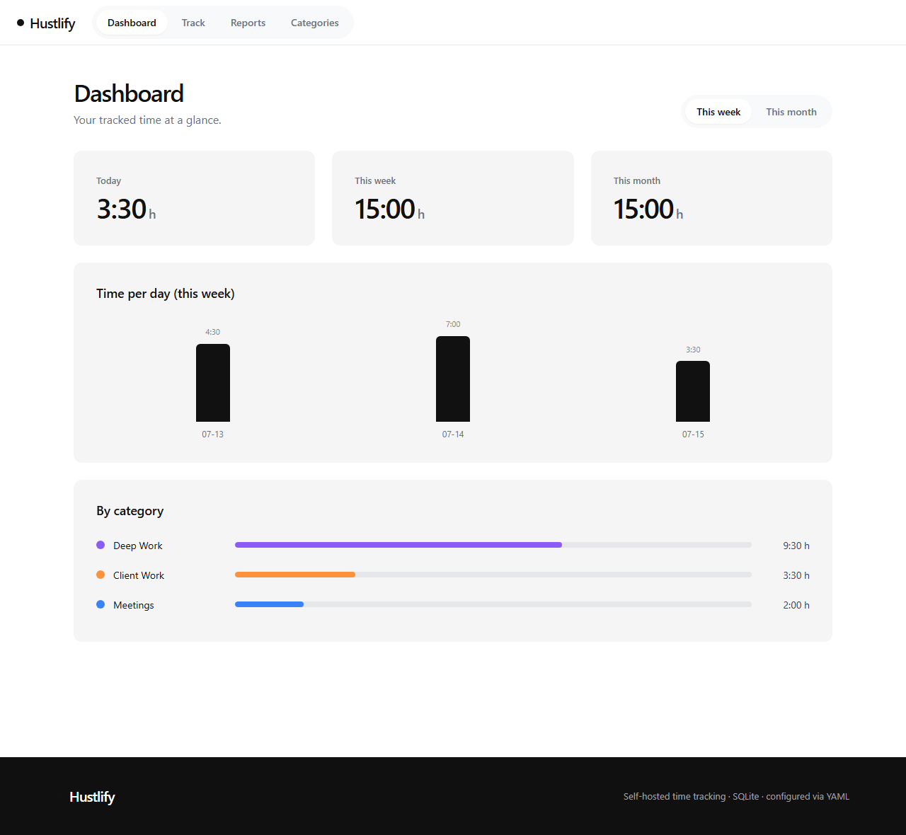

# Hustlify

**Self-hosted time tracking, configured entirely through a single YAML file.**

Hustlify is a small, neutral time-management web app built to run as one Docker
container on a home server or NAS. Track work with a live timer or by hand,
organize it into categories, watch your weekly target, and export a clean PDF
work report — all stored in a local SQLite database. Nothing is hardcoded to any
person or company: everything you'd want to change lives in `config.yaml`.



## Features

- **Live timer** — one click to start, one to stop. The running timer lives in
  the database, so it survives browser closes and container restarts.
- **Manual entries** — add or correct time by hand with start/end and a note.
- **Categories** — colored, archivable labels to organize your time. Deleting a
  category keeps its entries (they simply become uncategorized).
- **Dashboard** — today / this week / this month totals, an overtime balance
  against your weekly target, optional estimated earnings, a per-day bar chart
  and a per-category breakdown.
- **PDF work report** — a clean, day-grouped report with per-category totals and
  optional earnings, personalized from your YAML.
- **CSV export** — the raw data for any period, ready for a spreadsheet.
- **Search & filter** — filter entries by date range and category, and search
  notes.
- **Optional password** — set one in the YAML to require login; leave it empty
  for an open app on your LAN.
- **Timezone-correct** — days, weeks and reports follow the timezone you set.

## Quick start (Docker Compose)

1. Create a folder on your NAS and add a `config.yaml` (start from
   [`config.example.yaml`](config.example.yaml)):

   ```yaml
   app:
     title: "My Time Tracker"
     timezone: "Europe/Zurich"
   work:
     weekly_target_hours: 40
     hourly_rate: 0
     currency: "CHF"
   ```

2. Add a `docker-compose.yml` (see [`docker-compose.example.yml`](docker-compose.example.yml)):

   ```yaml
   services:
     hustlify:
       image: julianhintermann/hustlify:latest
       container_name: hustlify
       restart: unless-stopped
       ports:
         - "3000:3000"
       volumes:
         - ./config.yaml:/config/config.yaml:ro
         - ./data:/data
   ```

3. Start it:

   ```bash
   docker compose up -d
   ```

4. Open `http://<your-nas-ip>:3000`.

That's it — the SQLite database and session secret are created automatically in
the `./data` folder.

### Run without Compose

```bash
docker run -d --name hustlify -p 3000:3000 \
  -v "$PWD/config.yaml:/config/config.yaml:ro" \
  -v "$PWD/data:/data" \
  julianhintermann/hustlify:latest
```

## Configuration reference

Every key is optional; omitted keys use the defaults shown here.

| Key | Default | Description |
|---|---|---|
| `app.title` | `Hustlify` | Name shown in the header and browser tab. |
| `app.port` | `3000` | Port the server listens on inside the container. |
| `app.timezone` | `Europe/Zurich` | IANA timezone for day/week/month grouping and reports. |
| `app.first_day_of_week` | `monday` | `monday` or `sunday`. |
| `auth.password` | `""` | Empty = no login. Any value requires it before use. |
| `work.weekly_target_hours` | `40` | Weekly target. `0` disables overtime tracking. |
| `work.tracking_start` | `""` | ISO date (`YYYY-MM-DD`); overtime is counted from here. |
| `work.hourly_rate` | `0` | `0` hides earnings everywhere; any value shows estimates. |
| `work.currency` | `CHF` | Currency label shown next to earnings. |
| `report.person_name` | `""` | Printed on the PDF work report. |
| `report.company_name` | `""` | Optional company/employer on the report. |
| `report.footer_note` | `""` | Optional note at the bottom of the report. |

> **Note:** if you change `app.port`, map that same port in your compose file
> (e.g. `"8080:8080"` with `app.port: 8080`).

### Volumes

| Path | Purpose |
|---|---|
| `/config/config.yaml` | Your configuration file (mount read-only). |
| `/data` | Persistent SQLite database and the generated session secret. |

## Development

Requires Node.js 22.5+ (uses the built-in `node:sqlite`, so there is no native
build step).

```bash
npm install            # backend deps
npm --prefix web install
npm test               # backend unit + integration tests

# Run the two dev servers (API on :3000, Vite on :5173 with a proxy)
npm run dev:server
npm run dev:web

# Or build the frontend and run the whole app from the server on :3000
npm run build
npm start
```

Configuration during development is read from `./config.yaml` (set
`CONFIG_PATH` to point elsewhere) and data is written to `./data` (set
`DATA_DIR`).

## Tech

- **Backend:** Node.js, Express, built-in `node:sqlite`, `pdfkit`, `js-yaml`
- **Frontend:** React + Vite, framework-free CSS design tokens
- **Storage:** a single SQLite file
- **Image:** multi-arch (`linux/amd64`, `linux/arm64`)

## License

MIT — see [LICENSE](LICENSE).
